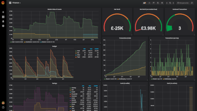

hledger-scripts
===============

Helpful scripts to do things with your [hledger][] data.  I use these
to supply data to a [grafana][] dashboard.




hledger-to-influxdb
-------------------

Copies your hledger data to an [influxdb][] database called "finance".

**Dependencies:** [influxdb][] and [stack][].

**Usage:**

```bash
$ influx
> drop database finance;
> create database finance;

$ ./hledger-to-influxdb.hs
```

Emptying, or recreating, the "finance" database is necessary, as this
writes *all* the data, regardless of whether it already exists.

This uses the default journal file, which is `~/.hledger.journal`.  To
use a different one, set the `LEDGER_FILE` environment variable.

**Output:**

This gives you a collection of measurements in your database.  These
are:

- `normal`, which is the value of each account at the end of every day
- `cost`, which is the value (cost basis) of each account at the end of every day
- `market`, which is the value (market basis) of each account at the end of every day
- `count`, which is the total number of transactions
- `market`, which is the market value of each commodity

Inside these measurements are values for accounts and currencies.
It's probably easiest to explore these through a tool
like [grafana][].

I find `normal` value is good for tracking cash in my wallet; `cost`
value is good for tracking my budget; and `market` value is good for
tracking my net worth.  I usually use `dailies` rather than `txns`, to
avoid weird spikes if there are multiple transactions on the same day.
I usually use `total` for account stats, and `delta` for transaction
stats.


market-prices
-------------

Downloads market values of commodities from a few different sources.

**Dependencies:** [python][] 3.

**Usage:**

```bash
$ cd market-prices

$ ./market-prices.py < commodities.json
```

**Configuration:**

The `commodities.json` file specifies what to download.  It is an
object where keys are commodities, and values are configuration for
how to get the current value.

Here is an example showing off all of the options:

```json
{ "commodities":
  { "BTC":   { "provider": "coinbase", "currency": "USD" }
  , "ETH":   { "provider": "coinbase" }
  , "LTC":   { "provider": "coinbase" }
  , "Euro":  { "provider": "ft_currency", "base": "EUR" }
  , "JPY":   { "provider": "ft_currency" }
  , "VADEA": { "provider": "ft_fund", "isin": "GB00B41XG308" }
  }
, "symbols":
  { "GBP": "£"
  , "USD": "$"
  }
}
```

There are three providers:

- `coinbase`, spot price from coinbase.  Arguments are:
  - `base`, the name of the cryptocoin (defaults to the commodity
    name)
  - `currency`, the currency to get the spot price in (defaults to
    "GBP")
- `ft_currency`, exchange rate from Financial Times.  Arguments are:
  - `base`, the name of the foreign currency (defaults to the
    commodity name)
  - `currency`, the currency to get the exchange rate in (defaults to
    "GBP")
- `ft_fund`, fund NAV from Financial Times.  Arguments are:
  - `isin`, the ISIN of the fund (defaults to the commodity name)
  - `currency`, the currency to get the NAV in (defaults to "GBP")

**Output:**

This gives a sequence of hledger market price directives like so:

```
P 2018-05-26 BTC $7536.47
P 2018-05-26 ETH £450.84
P 2018-05-26 LTC £90.95
P 2018-05-26 Euro £0.8752
P 2018-05-26 JPY £0.0069
P 2018-05-26 VADEA £212.16
```

The optional `symbols` object in the configuration maps currency names
to prefix symbols.

Any errors are printed as an [hledger][] comment.  For example, if the
ISIN for VADEA were incorrect:

```
P 2018-05-26 BTC $7536.47
P 2018-05-26 ETH £450.84
P 2018-05-26 LTC £90.95
P 2018-05-26 Euro £0.8752
P 2018-05-26 JPY £0.0069
; error processing commodity 'VADEA': could not find price
```

So there is no danger (in terms of producing an invalid journal) in
having a cronjob to run this script and append the results to a file;
you'll just need to manually fix any errors.


aggregate-fundingcircle
-----------------------

Aggregates interest payments and fees from a [Funding Circle][]
statement into totals.  Downloads market values of commodities from a
few different sources.

**Dependencies:** none.

**Usage:**

```bash
$ ./aggregate-fundingcircle.sh path/to/statement.csv
```

**Output:**

```
interest: 832
fees:     78
```

The aggregates are in pence.


[hledger]: http://hledger.org/
[grafana]: https://grafana.com/
[stack]: https://docs.haskellstack.org/en/stable/README/
[influxdb]: https://www.influxdata.com/
[python]: https://www.python.org/
[Funding Circle]: https://www.fundingcircle.com/uk/
